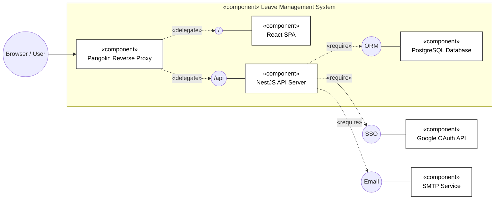

# System Architecture

## Overview

ระบบ Leave Management System ทำงานแบบ modern, decoupled monolithic full-stack application

- **Frontend:** React with Vite
- **Backend:** NestJS (Node.js framework)
- **Database:** Prisma ORM เชื่อมต่อกับฐานข้อมูล PostgreSQL
- **Environment:** จัดการ environment ด้วย Docker เพื่อให้การ build และ setup สามารถทำซ้ำได้ (reproducible)

## High-Level Diagram

## Component Breakdown

### Frontend (React + Vite)

- **Routing:** จัดการด้วย `react-router-dom` มีการแบ่งแยกส่วนที่ชัดเจนระหว่าง public routes (Login/Register) และ protected Dashboard routes
- **State Management:** ใช้ React Context/Hooks ร่วมกับการเรียก API ที่ optimize แล้วผ่าน Axios
- **Styling:** เขียนด้วย CSS Native ล้วน และเสริมด้วย responsive design (เช่น custom mobile overlays และ sidebars)
- **Axios Interceptor:** หน้าที่ดักจับ Error `401 Unauthorized` และยิงไปที่ endpoint `/auth/refresh` ของ Backend อัตโนมัติ เพื่อนำ `refreshToken` ไปแลก `accessToken` ตัวใหม่ผ่าน cookie

### Backend (NestJS)

ออกแบบสถาปัตยกรรมระดับ Backend โดยอิงตามหลักการ NestJS module-based DI (Dependency Injection):

- **`AuthModule`:** รับผิดชอบเรื่องระบบ Login, Google OAuth, 2FA, การ reset session, และกระบวนการเข้ารหัส/ตรวจสอบ JWT
- **`LeavesModule`:** ทำหน้าที่ดูแล lifecycle ของรายการลาส่วนตัวโดยเฉพาะ (เช่น route `/leaves`) ตั้งแต่การสร้าง, อัปเดต, ยกเลิก, รวมถึงการเปลี่ยนสถานะ
- **`LeaveModule`:** ทำหน้าที่เกี่ยวกับระบบ report และผู้ดูแลระบบ (เช่น route `/dashboard`) ใช้สำหรับดึงข้อมูลโควต้าวันลา, การดูประวัติการลา, และการรวบรวมสถิติระดับแผนก
- **`PrismaModule`:** ตัวแทนการเชื่อมต่อและดึงข้อมูลผ่าน PrismaClient ไปยังฐานข้อมูล
- **`Event Logging`:** มีระบบบันทึกประวัติการเรียก API และการเข้าใช้งานต่างๆ (EventLog) ในระบบฐานข้อมูล เพื่อใช้ตรวจสอบพฤติกรรม ระบบความปลอดภัย และระยะเวลาประมวลผล

### Database (Prisma / PostgreSQL)

- Prisma ช่วยให้การ query ข้อมูลเป็นแบบ type-safe อย่างสมบูรณ์
- **Key Tables:**
  - `User`, `Role`, `Department`
  - `LeaveType`, `LeaveQuota`, `LeaveRequest`
  - `EventLog` (ตารางสำหรับเก็บข้อมูลประวัติการใช้งาน API Request และ Tracking)

### Containerization (Docker)

- ตัวแอปพลิเคชันใช้งาน `docker-compose.yml` เพื่อจัดระเบียบ (orchestrate) และรันเซิร์ฟเวอร์ frontend, backend และ **Pangolin (Reverse Proxy)** อย่างปลอดภัย
- **Pangolin Proxy:** ทำหน้าที่เป็นตัวกลาง (gateway) หลักในการรับ request และกระจาย traffic ไปยัง Frontend (React) หรือ Backend (NestJS /api)
- **Frontend Dockerfile:** ทำการ Build ระบบ Vite application สำหรับเสิร์ฟไฟล์ Static SPA
- **Backend Dockerfile:** ทำการรวม (Build) ตัว NestJS TypeScript และสั่งเตรียมฐานข้อมูลด้วยคำสั่ง Prisma migrate/db-push ระหว่างที่กำลังสตาร์ทคอนเทนเนอร์
